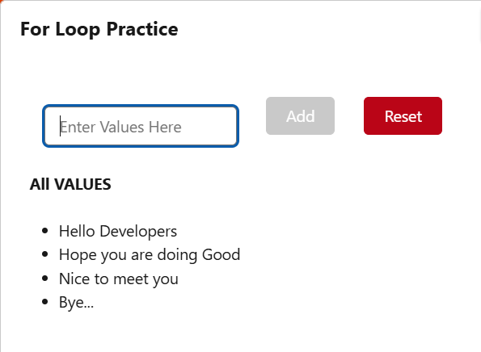

# 🔁 For Loop Practice - Lightning Web Component (LWC)

This is a simple Salesforce Lightning Web Component project that demonstrates how to **collect user input**, **store values in an array**, and **render them dynamically** using `for:each`. It's perfect for practicing list rendering, input handling, and SLDS layout in LWC.

---

## 🛠️ Tech Stack 

- ⚡ Salesforce Lightning Web Components (LWC)
- 💅 SLDS (Salesforce Lightning Design System)     
- 🚀 Apex-free, fully client-side logic        
 
---      
  
## ✨ Features         
         
- 📥 Input field for entering custom values    
- ➕ Add button to store each value in a list  
- ♻️ Reset button to clear all values
- ✅ Real-time list rendering using `for:each`    
- 💡 "No values added yet" message when the list is empty  
- 🚫 Add button is disabled when input is blank

---

## 📸 UI Preview 



---

## 🧠 Learning Outcomes

- LWC Event Handling (`onchange`, `onclick`)
- Reactive properties with `@track`
- Working with arrays and conditional rendering
- SLDS Grid layout for clean component alignment

---

## 📂 Project Structure

```bash

forLoopPractice/
├── forLoopPractice.html      
├── forLoopPractice.js       
├── project_Screenshort.png   
└── README.md                

```
---

## 🙌 Contributing

💡 If you have any suggestions, feel free to open an issue or ping me — I'm happy to collaborate and improve this project together!

---
 
## 📬 Contact

**Akash**  
🔗 [LinkedIn](https://www.linkedin.com)  
📧 akash.sfdc015@gmail.com  

> 🚀 Interested in building cool projects together? Let’s collaborate!

---

Happy building, Akash! 💙⚡

